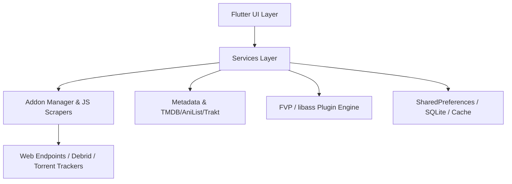

# Internal Architecture & Core Mechanics — PlayTorrioV3

This document provides a technical overview of **PlayTorrioV3**, detailing its core modules, data flow, streaming management, addon/scraper system, and UI architecture.

---

## 1. Architectural Overview

PlayTorrioV3 is a multi-platform media application built with **Flutter** and accelerated by native engines (**FVP / libmdk / mpv / libass**) and a JavaScript runtime for real-time web scraping and stream resolving.

---

## 2. Application Bootstrap (`main.dart`)

At application startup (`void main()`):
1. **Screen Configuration:** Immersive mode enabled (`SystemChrome.setEnabledSystemUIMode`).
2. **Native Plugin Registration:** `fvp.registerWith()` registers the hardware-accelerated video decoding engine.
3. **Core Asynchronous Services:** Initialized in parallel using `Future.wait`:
   - `AddonManager.instance.initialize()`: Loads scrapers and addon manifests.
   - `DownloadService.initialize()`: Restores persistent download tasks and queued state.
   - `GlassSettings.initialize()`: Pre-configures GPU liquid glass shader toggles.
   - `MyListService.initialize()`: Loads saved items and local favorites.
   - `TraktAuthService().initialize()` & `TraktSyncService.initialize()`: Restores Trakt.tv credentials and cloud sync state.
4. **Update Checks:** `AppUpdaterService` verifies remote GitHub releases in the background.

---

## 3. Core Modules & Data Flows

### 3.1 Scrapers & Addon Architecture (`assets/scrapers/` & `lib/services/addon/`)
* **JavaScript Execution:** Evaluates lightweight JS scrapers (`vidsrc.js`, `videasy.js`, `torrent_galaxy.js`, `knaben.js`, `cheerio.bundle.js`) to extract streams and metadata dynamically.
* **Reactive Stream Feeds:** `AddonManager.streamHomeSections()` yields content sections incrementally, rendering the hero carousel instantly without blocking on slower scrapers.

### 3.2 Metadata & Media Catalogs (`lib/services/metadata/`)
* Consolidates movie, series, anime, and manga metadata.
* Fetches from TMDB, AniList, and Stremio-compatible endpoints to populate `MovieDetail`, `CastMember`, `CrewMember`, `Genres`, and `Videos`.

### 3.3 Playback Engine & Subtitles (`lib/pages/player/`, `libass_plugin/`, `lib/services/subtitles/`)
* **Player:** Backed by `FVP` for smooth HLS, MP4, and torrent stream playback.
* **ASS/SSA Subtitles:** Powered by `libass_plugin` for styling and positioning complex subtitle files (essential for anime fansubs).
* **Subtitle Providers:** Automatic fetching and extraction via `SubDL` and built-in extractors.

### 3.4 Persistence & Cloud Synchronization (`lib/services/trakt/`, `lib/services/my_list/`)
* **Local Storage:** `MyListService` and `DownloadService` persist state in `SharedPreferences` with JSON serialization.
* **Bidirectional Sync:** Trakt integration pushes and pulls watch states, history, and user lists across devices.

### 3.5 UI Layer & Fluid Motion
* **LiquidDock:** Bottom dock navigation featuring liquid lens refraction and jelly physics, pre-warmed during intro to eliminate jank.
* **LiquidRevealRoute:** Custom circular-reveal transitions for seamless navigation across hubs.
