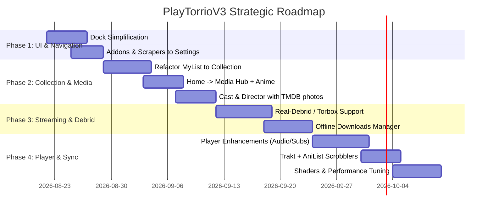

# Project Roadmap — PlayTorrioV3

This document outlines the strategic roadmap for UI/UX redesign, navigation simplification, modular refactoring, streaming capabilities, and core functional enhancements for **PlayTorrioV3**.

---

## 🎯 Primary Goals

1. **Streamlined Navigation:** Reduce bottom dock clutter down to essential hubs for a cleaner user experience.
2. **Unified "Collection" Hub:** Consolidate My List, Watchlist, Playback History, and Offline Downloads manager.
3. **"Media" Hub:** Evolve the home screen into a unified Media Hub with native Anime integration.
4. **Rich Visual Cast & Crew:** Display high-resolution TMDB headshots for actors and directors with direct navigation to their filmographies.
5. **Debrid Service Integration (Real-Debrid / AllDebrid / Torbox):** Enable high-speed cloud torrent streaming without peer/seed dependency.
6. **Advanced Video Player:** Auto-Next/Binge watching, audio track & subtitle switcher, `libass` anime subtitle styling, and gesture controls.
7. **Dual Scrobbling (Trakt + AniList):** Automatic progress tracking for movies/series (Trakt) and anime (AniList).
8. **Addons Management in Settings:** Centralize scraper and plugin configuration inside the settings view.

---

## 📅 Implementation Phases

---

## 📌 Module Breakdown & Critical Enhancements

### 1. LiquidDock & Main Navigation
* **Simplified Layout (Essential Hubs):**
  - 🎬 **Media:** Unified hub (Movies, TV Shows, and Anime with quick category filters).
  - 📖 **Manga:** Manga/comic reader and library.
  - 🎧 **Audio:** Music (Octave) and Audiobooks (AudiobookBay) with switcher.
  - 📂 **Collection:** Favorites, Watchlist, Playback History, and Downloads.

### 2. Collection (`lib/pages/collection/`)
* **Tab 1 - My List / Favorites:** User-saved media with custom sorting (date, title, year) and filtering.
* **Tab 2 - Watchlist:** Integrated watchlist tracking across providers.
* **Tab 3 - History & Continue Watching:** Granular playback resumption saved to exact timestamp.
* **Tab 4 - Downloads:** Full-featured offline manager supporting download queues, pause/resume, and local playback.

### 3. Media Hub & Anime
* Unify `HomePage` and `AnimePage`:
  - Top category selector: *All*, *Movies*, *Series*, *Anime*.
  - Airing schedule carousel powered by AniList.
  - Unified search across all content types.

### 4. Cast & Directors with Images (`lib/pages/details/`)
* Seamless `profile_path` integration from TMDB using `CachedNetworkImage` with fallback initials.
* Filmography exploration: clicking an actor or director opens `DiscoverPage` with their full work.
* Character role labels alongside actor names.

### 5. Debrid Providers (Real-Debrid, AllDebrid, Torbox, Premiumize)
* **Why Critical:** Eliminates dependence on torrent seeds, prevents ISP throttling, and enables instant 4K HDR playback via direct HTTP CDN links.
* **Functionality:**
  - OAuth / API Key login in Settings.
  - Instant cache check for torrent hashes.
  - Transparent magnet-to-stream resolution.

### 6. Video Player Enhancements (`lib/pages/player/`)
* **Touch & Mouse Gestures:** Vertical swipes for volume (right) and brightness (left); horizontal swipe for seeking.
* **Auto-Play / Next Episode:** Countdown prompt during credits to load the next episode automatically.
* **Audio Track & Subtitle Switcher:** In-player selection of embedded container tracks (MKV/MP4) and on-demand subtitle downloads (`SubDL`).
* **`libass_plugin` Integration:** Advanced SSA/ASS rendering for stylized anime subtitles and fonts.

### 7. Automated Scrobbling & Cloud Sync
* **Trakt.tv Scrobbler:** Automatically mark media as watched once 80-90% is completed.
* **AniList Scrobbler:** Automatically sync watched anime episode counts to the user's AniList profile.

### 8. Addons & Scrapers Management (`lib/pages/settings/`)
* Move addon administration out of the primary dock:
  - Addon repository browser.
  - Per-scraper toggle switches.
  - Over-the-air hot updates for JS scrapers.
